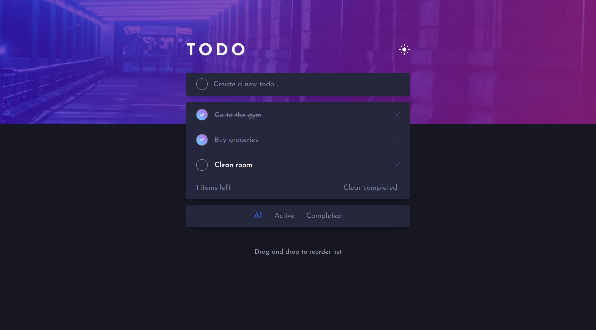

# Frontend Mentor - Todo app solution

This is a solution to the [Todo app challenge on Frontend Mentor](https://www.frontendmentor.io/challenges/todo-app-Su1_KokOW). Frontend Mentor challenges help you improve your coding skills by building realistic projects. 

## Overview

### The challenge

Users should be able to:

- View the optimal layout for the app depending on their device's screen size
- See hover states for all interactive elements on the page
- Add new todos to the list
- Mark todos as complete
- Delete todos from the list
- Filter by all/active/complete todos
- Clear all completed todos
- Toggle light and dark mode
- **Bonus**: Drag and drop to reorder items on the list

### Screenshot

### Links

- Live Site URL: [Link]([https://your-live-site-url.com](https://todo-list-nine-psi.vercel.app/))

## My process

### Built with

- Semantic HTML5 markup
- CSS custom properties
- Flexbox
- CSS Grid
- Mobile-first workflow
- [React](https://reactjs.org/) - JS library
- [Vite](https://vitejs.dev/) - Vite
- [Sass](https://sass-lang.com/) - For styles

### Useful resources

- [Sortable Js](https://github.com/SortableJS/react-sortablejs) - I used this to sort the list items

## Author

- Website - [Personal Portfolio](https://www.your-site.com)
- LinkedIn - [Emi Acerbi](https://www.linkedin.com/in/emiliano-acerbi-7a7141235/)

## Acknowledgments

Thanks to [Frontend Mentor](fontendmentor.io) for the challenge!
